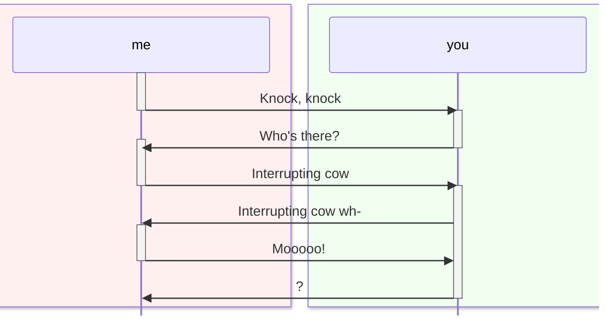

# Interrupting Cow Knock-Knock Joke

```mermaid
%% Mermaid diagram, put this in mermaid.live if it doesn't show

%%{
  init: {
    "sequence": {
        "mirrorActors": false,
        "diagramMarginX": 10,
        "diagramMarginY": 10,
        "boxTextMargin": 5,
        "noteMargin": 10,
        "messageMargin": 1,
        "wrap":true,
        "width":300
    }}
}%%


sequenceDiagram
    box rgb(255,240,240)
        participant A as me
    end 
    box rgb(240,255,240)
        participant B as you
    end 

activate A
A->>B: Knock, knock
deactivate A
activate B
B->>A: Who's there?
activate A
deactivate B
A->>B: Interrupting cow
deactivate A
activate B
B->>A: Interrupting cow wh-
activate A
A->>B: Mooooo!
deactivate A
B->>A: ?
deactivate B

```