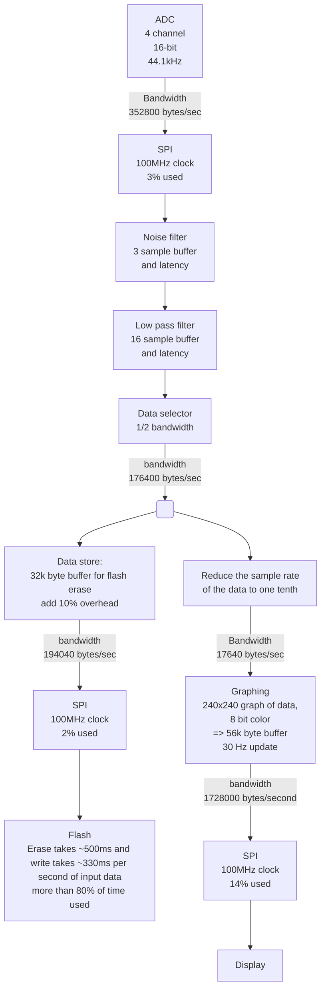

```mermaid
%% Mermaid diagram, put this in mermaid.live if it doesn't show
flowchart TD
    adc["`ADC 
        4 channel 
        16-bit 
        44.1kHz`"] 
    adcspi["`SPI
        100MHz clock
        3% used`"]
    adc -->  |"`Bandwidth
        352800 bytes/sec`"| adcspi
    denoise["`Noise filter
        3 sample buffer
        and latency`"]
    adcspi --> denoise
    lpf["`Low pass filter
        16 sample buffer
        and latency`"]
    denoise --> lpf
    selector["`Data selector
                1/2 bandwidth`"]
    lpf --> selector
    dstore["`Data store:
        32k byte buffer for flash erase
        add 10% overhead`"]

    selector -->  |"`bandwidth
                    176400 bytes/sec`"| tmp(" ")
    tmp --> dstore

    flashspi["`SPI
        100MHz clock
        2% used`"]
    dstore --> |"`bandwidth
                    194040 bytes/sec`"| flashspi
    
    flash["`Flash
                Erase takes ~500ms and 
                write takes ~330ms per 
                second of input data
                more than 80% of time used`"]
    
    flashspi --> flash

    downsample["`Reduce the sample rate
         of the data to one tenth`"]

    graphcode["`Graphing 
                240x240 graph of data, 
                8 bit color
                => 56k byte buffer
                30 Hz update
                `"]
    tmp -->downsample
    downsample --> |"`Bandwidth
                    17640 bytes/sec`"| graphcode

    display["Display"]
    displayspi["`SPI
        100MHz clock
        14% used`"]

    graphcode --> |"`bandwidth 
                    1728000 bytes/second`"|displayspi
    displayspi --> display  

```
